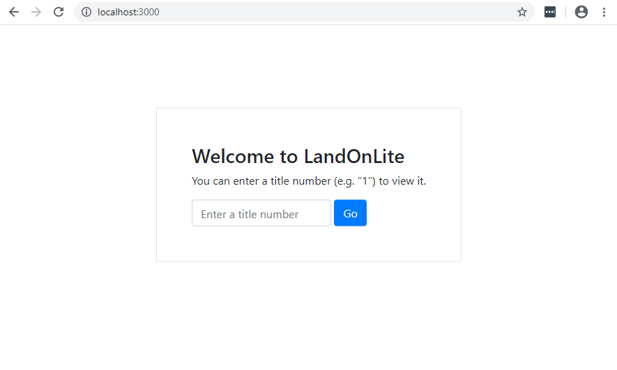
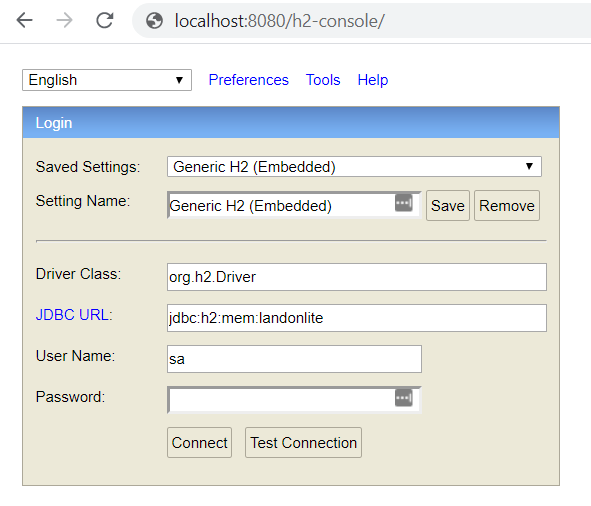

# Sample App for STEP Technical Interviews

This application is comprised of a Kotlin / Spring Boot API which uses an in-memory H2 database via the
EBean ORM. It has a React JS front-end which can be found in the `web` folder of this repo.

It implements a primitive title register called "LandOnLite". There is a single database table called "title", which
records titles. Like a real title, these titles give people ownership rights to some land. A title in LandOnLite has a
description (e.g. "Lot 1 on Block 1") and an owner.

Users can look up a title by its title number to view it, and (as LandOnLite runs on a trust-based model) anyone can
change the ownership of a title, though only conveyancing lawyers should.

You are more than welcome to prepare a solution to the problem statement before the interview - we'll ask you to extend it with pseudo code if you do.

Below are instructions on how to run the application, and below that are instructions on what we will talk about in the interview. There are instructions that depend on your area of skill and the role you are applying for. Feel free to look at the other instructions if that would also show of your strengths.

## Running the application

### Running the API

The API has no external dependencies. It can be run from inside an IDE such as IntelliJ IDEA, or from the command
line with `gradlew bootRun`.

### Running the Web Front-end

The React front-end is in the `web` folder of this repo. `cd` into this folder and run `npm install` to install required
libraries.

Start the web front-end using `npm start`. It will automatically pick up any changes that are made while it's running.

### Accessing the Application and Database

Once the API and Front-end are running, point your browser to http://localhost:3000/ and the LandOnLite application
should appear

To access the H2 database console, go to http://localhost:8080/h2-console and use the credentials shown below:

Bare in mind this is an _in-memory_ database so any manual data or schema changes will be lost when you restart the
API.

# Application developer interview

We are going to ask you to modify the application so that when someone changes the owner name on a title, it is tracked so that anybody can see the history of owner names when they look at the title.

# UI/UX focused interview

Mocking out a few user experiences from the  conversatino list below. Feel free to do in in code (React) or what ever tool you use: 
1. Think aboout how users might navigate between other LINZ applications. We would like to have the same UX and UI across apps. These apps are Survey, Title management, and a Title/Survey Search application. 
2. Customer detail management. Customers belong to on or more legal or survey firms. They swap between them daily. How might they know what firm they are logged into as?
3. How might we share a common UI and UX across multiple web applications built by separate, but collaborative teams?
4. Can you tell us about a time you've implemented a responsive layout for a complex page? 
5. How do you handle CSS specificity?  
6. Tell us about the various ways you've animated components in the UI?  
7. Have you had experience around implementing accessibility? 
8. Is there a way of selecting all P tags that don't have a certain attribute assigned to it? How flexible are these selectors? 
9. How can you ensure the CSS you're using is suppported in all browsers that are in scope

# Devops focused interview

This repo contains the scripts for DevOps Technical Interview

1. We have an application (frontend – ReactJS, backend that exposes api that retrieves data from database – Kotlin) and we are building it as a Docker image.

- What kind of cloud architecture would you design for managing container workloads for this application on AWS?
- Please prepare a simple cloud architecture diagram to explain your answer and you can draw it on the whiteboard.

2. There is a Jenkinsfile in this repository

- Could you please tell us, based on the Jenkinsfile, what does the pipeline do?
- I want to be notified when a stage fails, how can we do it?
